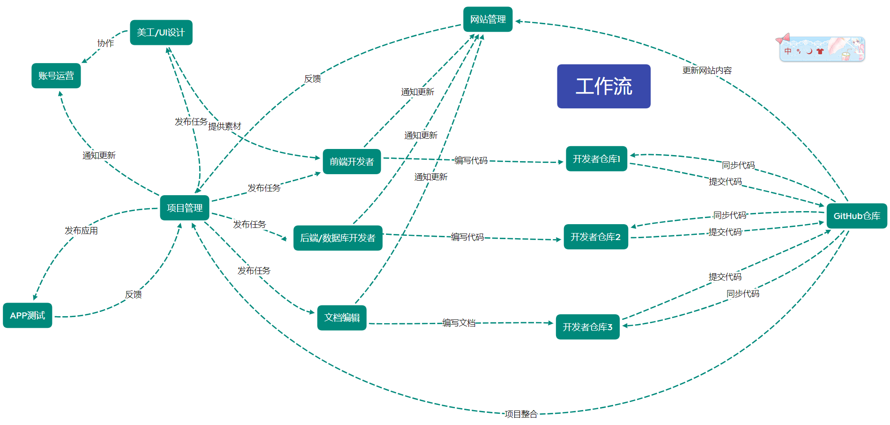

# 黄色仓库项目手册

## 欢迎加入黄色仓库项目
[点击查看开发日志](资料/开发日志/开发日志.md)  
[快速记录](资料/快速记录/快速记录.md)

---
## 接口文档

[黄色仓库接口文档](https://cjxqqllmxg.apifox.cn/)

---
## 项目介绍文档

[黄色仓库(APP开发)项目介绍与开发者必读](手册/黄色仓库APP开发项目介绍与开发者必读.md)

---
## 团队成员信息
[团队成员信息](手册/开发人员信息.md)

---
## 如何上手项目
项目上手流程
（联系项目管理进群， 进群改备注）

_**1**_.  向罗德运提供面试资料

四张截图
（github主页截图，
ChatGpt使用截图，
Cursor使用截图，
Github desktop拉取本仓库到本地截图）

_**2**_.  加入仓库

项目负责人邀请你进入代码仓库。

_**3**_.  克隆项目代码

克隆项目代码到本地（使用GitHub Desktop）
提交第一次代码（添加成员信息），熟悉如何提交代码。使用GitHub Desktop进行提交，了解Git的基本操作，如拉取、提交、推送等。

_**4**_.  添加成员信息

在Golden store/手册/开发人员信息.md中添加自己的信息，用GitHub desktop申请pr，熟悉GitHub提交操作。

_**5**_.  配置开发环境 - 联系洪庆杨

（下载必要的软件包括：_GitHub Desktop、Hbuilderx、Pycharm、VScode、cursor）

配置好相应的数据库、依赖等，确保开发环境可以顺利启动。
确保开发环境配置成功后，将前后端代码跑起来。本地测试前后端是否能正常运行，确保开发流程顺畅。

_**6**_.  任务分配

查看微信群聊（进群方式由管理拉进群）中置顶的在线文档，了解当前的开发任务和优先级。确认任务内容和时间节点，确保自己的工作与团队需求同步。
进行合作开发
与团队成员合作开发，确保代码合并和提交时遵循团队约定的流程。在开发过程中，与团队成员保持积极沟通，协作推进任务。

   
**测试账号**：3370942916@qq.com 
**测试密码**：@Lzq030424

---
## 如何使用GitHub协作
1. pull main分支的最新代码

2. 新建一个branch（分支） 

3. 在新的开发分支commit和push（注意，如果已经在main分支上修改的可以将main分支上的修改移动到新建的分支）

4. 在GitHub网页端发起一个pull request（请求合并到main分支）请求，由审核人审核各位提交的代码并决定是否合并到main分支

5. 审核通过后pull main分支的最新代码

6. 删除已经合并的分支，并基于main分支新建一个相同名称（XXX的开发分支）的分支

7. 循环以上步骤进行协作

   

---
## 经验帖
1. MySQL数据库命令：
   1. 导出数据库命令：`system mysqldump -u root -p hsck_data > 路径\hsck.sql`
   2. 删除原有数据库并重新创建数据库命令：`mysql -u root -p -e "DROP DATABASE IF EXISTS hsck_data; CREATE DATABASE hsck_data;"`
   3. 导入数据库命令：`mysql -u root -p hsck_data < "这里替换为你的仓库路径/GoldenStore/后端/数据库文件/hsck_data_0xx.sql"`
   
2. 安装Python缺少的模块：在后端文件夹命令行运行：`pip install -r requirements.txt`，就可以了

3. 免费使用Cursor Pro：[点击获取](https://github.com/yuaotian/go-cursor-help)
---

## 我们共同遵循的规则

### 前端部分遵循规则

1. vue的缩进保持两个空格，而不是4个空格
2. 重要的配置文件非必要不更改（如：config.py,config.js）

### 后端部分遵循规则

1. 仓库后端与开发者工具使用python开发，其他配套H5可以使用其他语言如：Java

### 数据库部分遵循规则

1. 测试MySQL数据库密码统一改成123123
2. MySQL数据库版本使用8.0版本

### 其他规则

1. commit的时候尽量分功能进行提交
2. 不提交过程中产生的缓存文件，如：*.pyc

3. GitHub提交样例（供参考）：
   

---

## 常用网址

1. [公司网站](https://putianikun.cn)

2. [ChatGPT](https://chat.openai.com)

3. [GitHub](https://github.com)

---
## 教程与手册
1. [访问外网教程](手册/教程/访问外网教程.md)
2. [免费VPN网址](https://ikuuu.one)
3. [Github使用教程](手册/教程/Github使用教程.md)
4. [在pycharm中同步GitHub仓库教程](https://blog.csdn.net/john_bian/article/details/94657057)
5. [GitHub 版本回退教程](https://www.bilibili.com/video/BV1KE411w7Dc/?share_source=copy_web&vd_source=7f54efe1da20c04e64d8b69684311984)
6. [Markdown简单教程](https://www.bilibili.com/video/BV1si4y1472o/?share_source=copy_web&vd_source=7f54efe1da20c04e64d8b69684311984)
7. [导入uView-plus攻略](手册/教程/导入uView-plus攻略.txt)
8. [项目打包手册](手册/项目打包手册.md)
9. [黄色仓库使用手册](手册/黄色仓库使用手册.md)
10. [npm 包管理工具的使用教程](手册/教程/npm 包管理工具的使用教程.md)
11. [prettier 代码格式化简明使用教程](手册/教程/prettier 代码格式化简明使用教程.md)