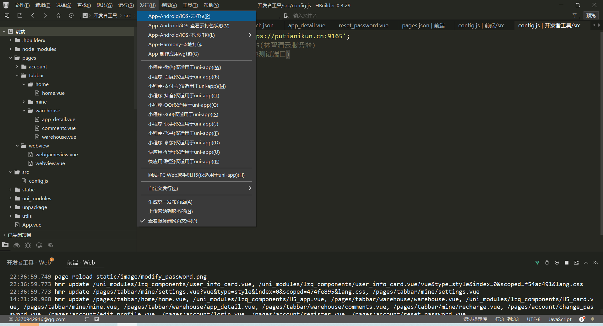
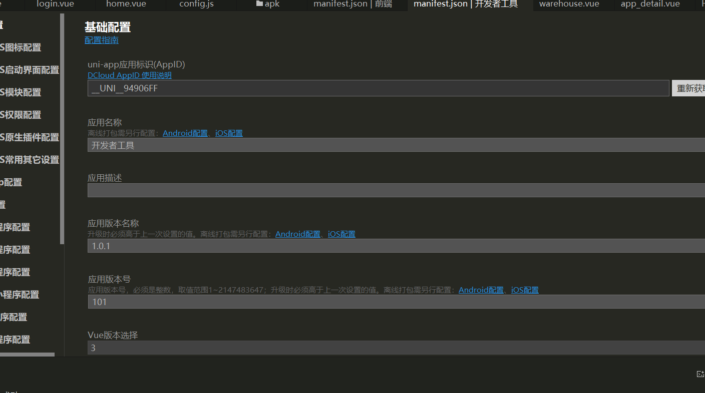
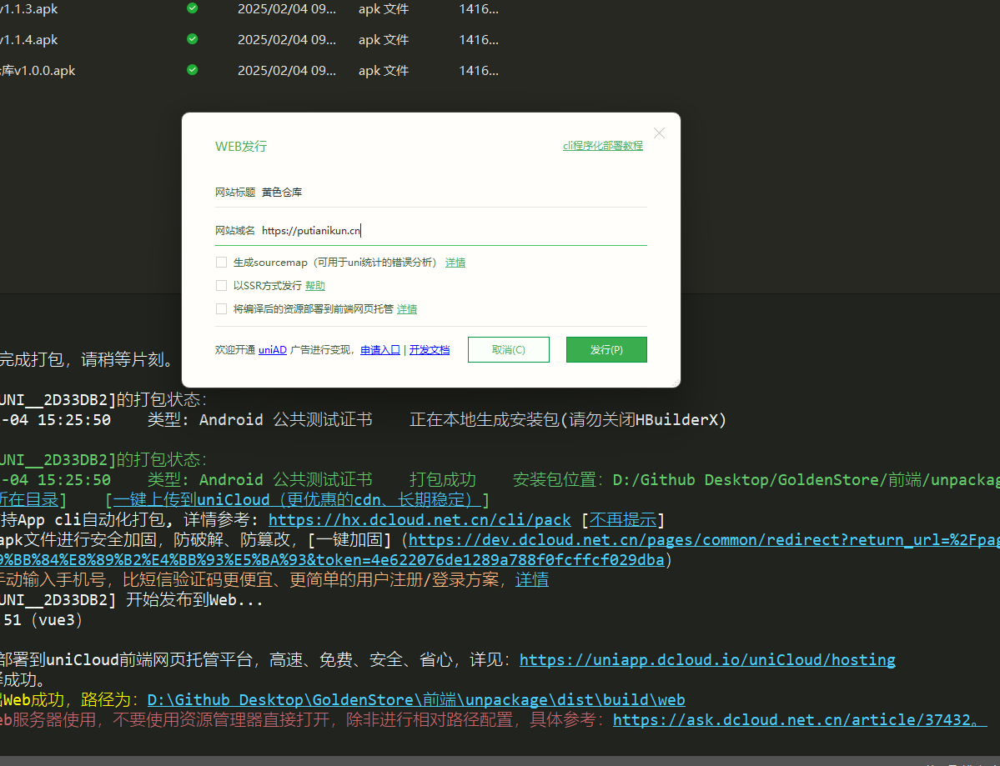
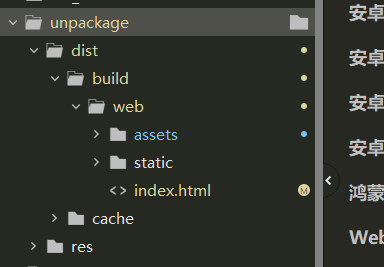
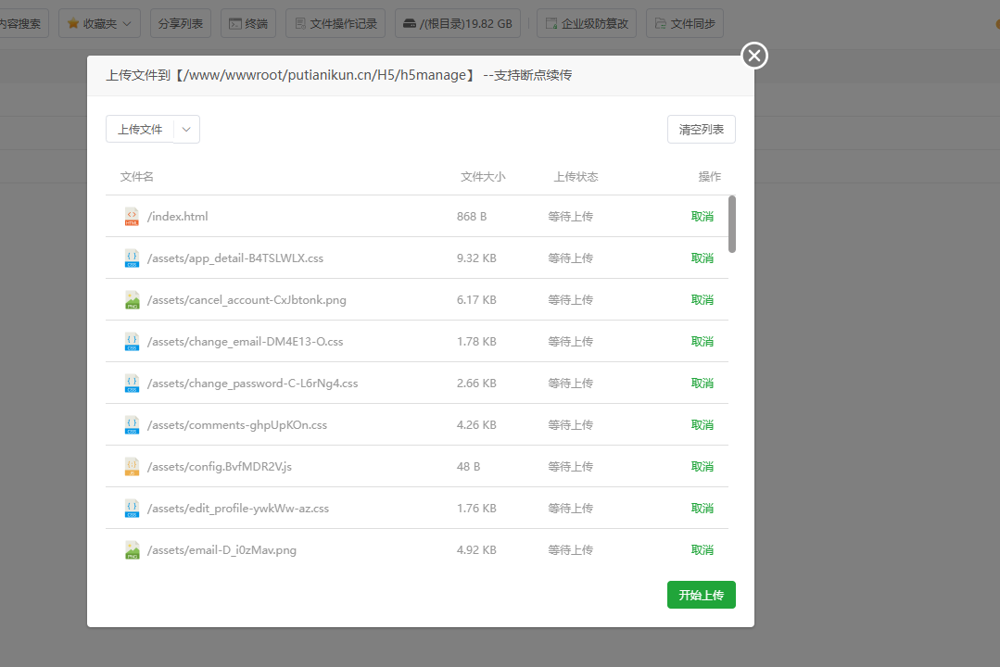
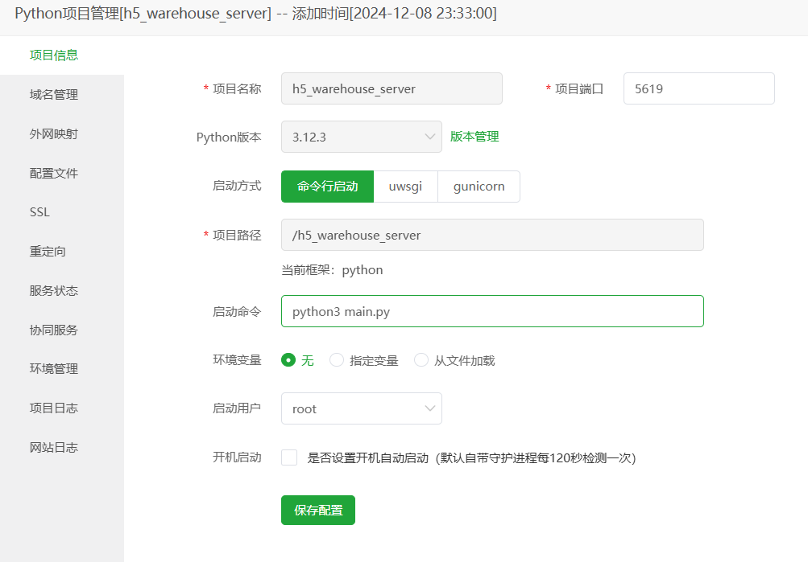
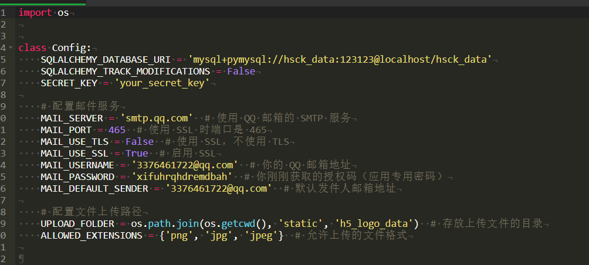
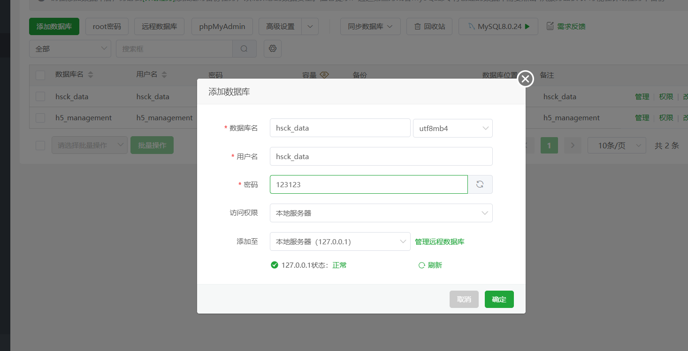
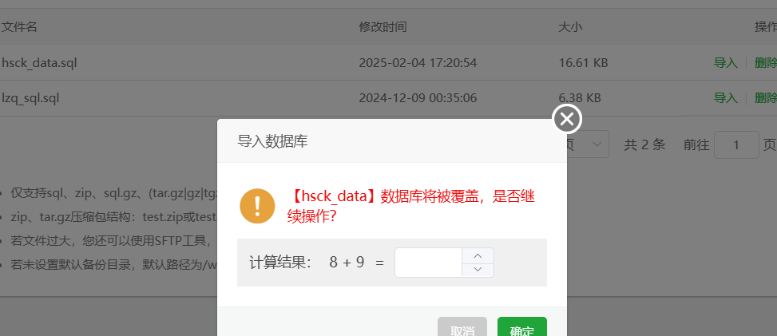
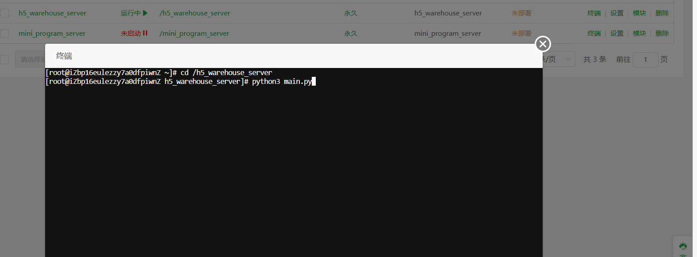

# 项目打包手册
## 步骤概览
1. 打包前端vue
   1. 修改项目测试域名
   
   2. 导出apk文件
   
   **把Android包名改成com.beisi.hsck**
   **然后将前端目录下面的hsck.keystore证书文件上传，密码是123123**
   3. 
   
2. 把H5部署到服务器上面
   1. 修改项目测试域名（同上）
   2. 进行打包
   首先manifest.json修改基础配置，先点击appid旁边的重新获取，然后应用名称改为开发者工具
   
   然后点击上面发行然后选择这个按钮
   
   
   然后发行等一会会出现一个目录，web目录下面的
   
   然后后面把assert、static文件夹还有index.html文件放到宝塔那边
   3. 在服务器上部署H5
   将web文件夹下面三个文件放到这个目录下面
   
   
3. 启动后端服务器
   1. 复制后端代码到服务器
      1. 复制主项目的后端代码到服务器
      后端代码main.py最后面的端口改成这样(切记切记要拖到宝塔服务器里面在双击修改)，如图示
      
      把后端的这些文件夹复制到宝塔的这个目录h5_warehouse_server下面
      
      2. 复制配套H5后端代码到服务器
   2. 配置后端环境
      1. 配置python依赖库
      
      2. 如果有Java后端的项目也配置一下
   3. 在服务器导入准备好的数据库
      1. 导出本地测试的数据库
      数据库文件config.py((切记切记要拖到宝塔服务器里面在双击修改))这里的用户名(hsck_data)、密码(123123)要跟宝塔里面的数据库面板设置的一样
      
      2. 将导出的数据库导入服务器
      点击新建数据库，在数据库新建数据库然后把本地的sql文件上传上去然后就可以运行了
      
      然后新建数据库之后本地上传导入sql文件
      
      然后导入显示成功即可
      
      
   4. 启动后端
      在网站这边，有一个h5_warehouse_server，状态那边设置启动就好了
      