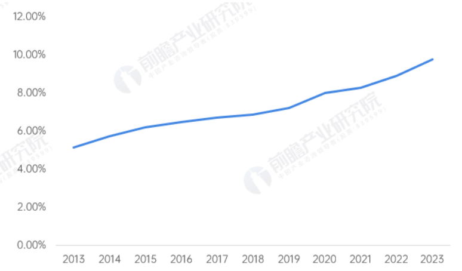

## 黄色仓库使用手册

[TOC]

### 一、前言

#### 1.1引言

在当今互联网高速发展的浪潮中，技术的革新与用户需求的演变共同推动着应用生态的持续进化，互联网技术以其迅猛的势头重塑着全球经济格局。我国，作为全球互联网大国，更是见证了软件行业从萌芽到繁荣的壮阔历程。2013-2023年，短短十年间，软件行业收入占我国GDP的比重从5.14%跃升至9.78%，这一显著增长不仅彰显了软件行业的蓬勃生机，更凸显了其在国民经济中的核心地位。
随着人工智能的崛起，独立开发者如雨后春笋般涌现，他们渴望在一个更自由、更开放的环境中展现创意与才华。然而，当前国内软件市场广告泛滥、体积臃肿、功能冗余等问题日益凸显，加之微信小程序等平台对开发者审核严格、类目限制较多，使得众多优秀应用难以脱颖而出。

图 1  2013-2023年我国软件行业收入在GDP中的比重变化图

#### 1.2绪论

在互联网技术的迅猛发展与用户需求的日益多元化的双重驱动下，软件行业正经历着前所未有的变革。福州倍司网络科技有限公司，凭借敏锐的市场洞察力和对技术创新的不懈追求，顺应时代潮流，倾力打造了“黄色仓库”项目。
“黄色仓库”不仅是一款便捷的APP，更是一个集H5技术应用、开放生态、友好体验于一体的创新平台。它如同一座桥梁，紧密连接着用户与开发者，致力于打破传统应用市场的壁垒。在这里，用户可以摆脱手机APP占用内存大、广告弹窗频繁、功能复杂冗余的困扰，享受更加纯净、高效的使用体验；开发者则可以摆脱严格的应用审核要求和上架成本高的束缚，在一个更加自由、开放的环境中释放创意，实现价值。
“黄色仓库”的诞生，不仅是对当前软件市场痛点的有力回应，更是对未来应用生态的积极探索。它以其独特的魅力和无限的潜力，预示着H5应用新时代的到来，为我国软件行业的持续发展注入了新的活力和动力。

图 2  黄色仓库logo图

### 二、运行要求及方法

#### 2.1硬件要求

- 最低配置：骁龙625或同级别处理器

- 512MB运行内存
- 至少128MB 内存空间
- 推荐配置：骁龙835或同级别处理器
- 1GB运行内存
- 1GB内存空间

#### 2.2环境要求

- 最低配置：安卓5.0及以上系统

- 推荐配置：安卓7.1.2及以上系统

#### 2.3运行方法

下载app后用文件管理器打开，唤起软件包管理器安装，安装完毕后打开即可。

### 三、APP架构

在互联网技术的浪潮中，黄色仓库项目以其独特的定位和前瞻性的设计理念，成为连接开发者与用户、推动H5应用生态繁荣的重要桥梁。项目采用了前后端分离的架构设计，确保了系统的灵活性和可扩展性。前端使用uniapp框架，实现了跨平台、一致性的用户界面，为用户提供了无缝的使用体验。后端基于Python的Flask框架，构建了稳定、高效的服务逻辑，保障了系统的运行效率和数据处理能力。同时，项目选用MYSQL作为数据库，确保了数据的安全、快速检索和高效管理。整体技术栈的精心选择和架构设计，不仅体现了项目的先进性，也为用户提供了稳定、流畅、优质的体验。黄色仓库项目，正以其创新的技术和卓越的服务，赋能未来，引领互联网应用的新潮流。

图 3 项目架构图

### 四、功能介绍

#### 4.1主页

黄色仓库应用界面以简洁直观为设计原则，底部黄色导航栏清晰划分主页、仓库与我的三大功能区域，方便用户快速切换。主界面包含开发者上架的多个不同的H5就流应用，以及开发者工具、反馈工具、在线文档等提交反馈的开发参考的入口，满足用户多样化需求。整体界面色彩鲜明，操作便捷，致力于为用户提供高效、愉悦的使用体验。

图 4 主页界面图

#### 4.2仓库

仓库界面精心设计了直观的应用展示区域，上方配有搜索框及“综合”、“最新”、“好评”和“用户数”等筛选条件按钮，便于用户快速定位所需应用。主展示区分类展示了各类应用，如反馈工具、音乐平台等，每个应用均附有评分和添加按钮，方便用户评估和操作。底部导航栏包括“主页”、“仓库”和“我的”三个选项卡，为用户提供清晰的导航体验。

图 5 仓库界面图

#### 4.3我的

“我的”界面是用户个人信息管理的中心，在这里您可以轻松地查看和管理您的账户信息。界面顶部显示了您的用户名和邮箱地址，便于识别和确认身份。点击右侧箭头图标可以进入邮箱管理页面，进行邮件收发等操作。此外，界面还提供了两个主要的入口：“H币”和“设置”。

- H币：点击此选项，您可以查看和管理自己的虚拟货币余额，了解当前持有的H币数量，并进行相关的充值、消费等活动。
- 设置：这是一个重要的功能模块，允许您自定义和调整各种偏好设置，以满足个性化需求。例如，您可以在此更改密码、更新个人信息、选择主题样式等。

图 6 我的界面图

#### 4.4充值

本界面为用户提供了便捷的H币充值服务。用户可以选择预定的充值金额（10 H币、20 H币、100 H币），也可以自行输入其他金额。选定金额后，系统将显示对应的支付金额，用户确认无误后，点击“确认充值”按钮即可完成充值操作。

图 7充值界面图

### 五、应用前景

#### 5.1技术可行性分析

黄色仓库项目在技术层面上展现了高度的可行性和先进性。首先，项目采用的前后端分离架构是当前互联网应用开发的主流趋势，这种架构不仅提高了开发效率，还使得系统更加灵活和易于维护。前端使用的uniapp框架能够实现跨平台开发，大大减少了开发成本和时间，同时保证了用户在不同设备上获得一致的使用体验。
后端基于Python的Flask框架，以其轻量、高效和易于扩展的特点，为项目的稳定运行提供了有力保障。此外，MYSQL作为成熟的数据库解决方案，其强大的数据管理和检索能力为项目的大数据需求提供了可靠支撑。
在技术实现上，项目团队具备丰富的开发经验和深厚的技术积累，能够确保项目的顺利实施和持续优化。因此，从技术角度来看，黄色仓库项目具备充分的可行性，能够应对未来市场的需求和挑战。

#### 5.2市场可行性分析

市场方面，黄色仓库项目同样展现出广阔的应用前景和巨大的市场潜力。随着互联网的普及和移动设备的广泛使用，H5应用市场呈现出快速增长的趋势。用户对于便捷、高效、多样化的应用需求日益旺盛，为黄色仓库项目提供了广阔的市场空间。
此外，项目独特的盈利模式——前期通过收取开发者的推流费用，后期通过对开发者售卖的H5应用抽成——不仅为项目自身带来了可持续的收益来源，也为开发者和用户创造了共赢的局面。这种模式有效地激发了开发者的创作热情，推动了优质应用的涌现，进而吸引了更多用户的关注和使用。
同时，黄色仓库项目还注重用户体验和开发者服务的提升，通过不断优化推荐算法、增强社交互动等功能，增强了用户粘性和活跃度。在市场推广方面，项目团队也将采取多种策略，包括线上线下活动、合作推广等，扩大项目的影响力和市场份额。

综上所述，从市场角度来看，黄色仓库项目具备强大的市场可行性和广阔的应用前景，有望在激烈的市场竞争中脱颖而出，成为H5应用生态的重要一环。

---
