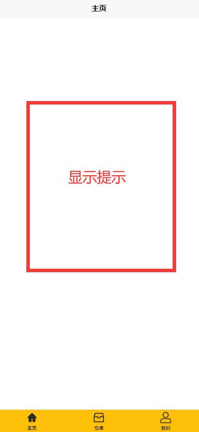
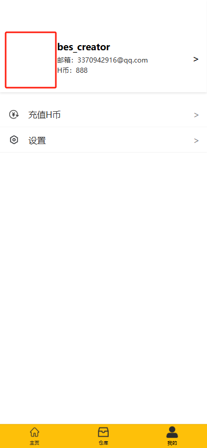
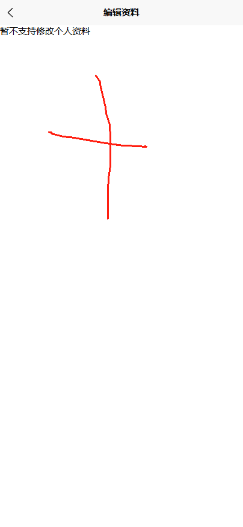
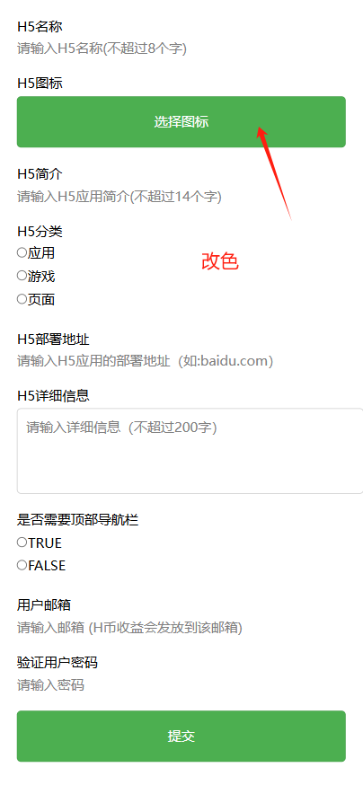

# 项目开发日志
## v1.1.10
1.添加应用在列表直接添加是正常的，点进应用里面添加就会出问题
2.在主页将应用全部删除后，没有自动退出编辑模式，从仓库添加应用返回主页仍处于编辑模式

## v1.1.9
1. 数据库不能暴露在公网，需要使用内网穿透
2. 用户注册完之后，先自动添加一些官方应用（如：反馈工具、开发者工具、U+教程、U+更新）（子杰负责）
3. 反馈工具（由新人负责）
4. 开发者工具的管理部分（由？？负责）
5. 软著撰写（包含U+教程）（由林智清负责）
6. U+更新工具（由新人负责）

## v1.1.8
1. 需要根据app_exposure（曝光量排序）、app_release_data(时间排序)、app_user_count(用户量排序)、app_user_scores(评分排序)几个排序表更新app_approval(推荐排序表)(罗德运已完成)
2. 统一UI风格（林智清负责）
3. 点击相关应用推荐的应用图标可以进入相关应用的详情页面（由子杰负责，子杰已完成）

## v1.1.7
1. 可以拖动更改图标顺序（前端做好了by罗德运）
2. 晚上修改邮箱与修改密码功能（前端做好了）
3. 部分（一个用户）无法使用密码正常登录的问题（罗德运已修复）
4. 增加头像修改的后端接口（林智清已修复）
5. 增加用户名修改的后端接口
6. 增加更换邮箱的后端接口
7. 增加修改密码的后端接口
8. 增加找回密码的功能
9. 增加兑换H币的后端接口
10. 应用详情页面
    1.  增加用户评分功能接口
    2.  增加用户使用H币增加曝光的接口
    

## v1.1.6
### H5详情页更新
1. 点击进入详情页显示应用的详细信息（需要请求后端）（前端做好了）
### 用户评价系统
1. 在详情页可以对应用进行打分，提交后端
### 数据库触发器更新
1. 用户提交打分，使用触发器更新数据表格
2. 需要写的触发器（考虑实时返回？？？）
   1. 当用户添加或者删除应用的时候，用户表要更新
   2. 当添加曝光的时候，曝光表要更新，综合排序表要更新
   3. 当用户评分的时候，评分表要更新
   4. 当开发者添加应用的时候，要自动添加日期，这个现在看起来还没有做到。
### 加入更多游戏类型与页面类型的H5  

## v1.1.5
### 前端更新
1. 当主页没有应用的时候，在屏幕中间提示去仓库添加，点击后跳转仓库  
   
2. 显示用户的默认头像   
     
3. 编辑资料提供修改昵称与头像功能  
   
### 开发者工具更新
1. 优化开发者工具提交表单  
   
2. 更改为黄色仓库主题色  
   

